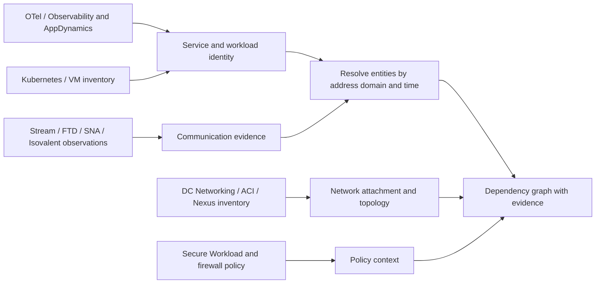

# Application Dependencies and Network Context

## Scope

The pilot covers applications on both VMs and Kubernetes. Inputs can come from Splunk Stream, OTel collectors and Splunk Observability Cloud, AppDynamics, Cisco DC Networking/ACI/Nexus, Isovalent, FTD, Secure Workload, and Secure Network Analytics (SNA).

The proposed result is a graph that connects applications, services, workload instances, network endpoints, and their network context. Each relationship retains its evidence source and observation interval. A traced service call, an observed flow, a configured policy, and an inferred network path express different facts and need distinct relationship types.

## What each source contributes

| Source | Useful contribution | Condition to establish |
| --- | --- | --- |
| OTel / Observability APM | Service identity, trace relationships, remote service names, environment and runtime context | Application instrumentation must emit the relevant spans and resource attributes; a collector alone does not discover every application call. |
| AppDynamics | Application/tier/node identity, business transaction and performance context | The inspected TA exports status and performance events, plus application-level backend records (`source=remote_services`) when "Remote Services Status" is enabled. A separate Controller metadata collection is needed for node addresses and tier/node-to-backend binding. |
| Stream NetFlow/IPFIX | Endpoint communication, ports, volume, times, exporter/interface and sampling context | The inspected 8.1.6 NetFlow reference is disabled by default. Exporter templates and deployed field selection determine coverage; translated tuples and VRF require explicit validation. |
| Isovalent | Workload/process-aware connection evidence for Kubernetes and supported Linux deployments | Confirm whether the feed is Tetragon process events, aggregated connection logs, or Hubble flows; these have different schemas and coverage. |
| Cisco DC Networking / ACI / Nexus | ND flow/endpoint records; APIC endpoint IP/MAC, VM and attachment objects; Nexus inventory/interfaces/neighbors | The inspected 1.2.2 inputs are disabled until configured. Validate the selected classes, device commands, address domains and actual payloads before asserting complete topology. |
| FTD | Connection observations, interfaces/zones, application classification, and policy/rule identifiers | Select the required connection event families; confirm translation addresses/ports and action fields in samples before using them to bridge NAT or assert allow/deny decisions. |
| Secure Workload | Alert scope, segmentation/policy context, and security fields | The inspected Splunk input receives alerts over syslog; it does not import the platform's complete workload inventory or dependency graph. |
| SNA | Flow summaries, application classifications, host groups, and security context | The inspected input collects selected network insights; top-flow summaries do not establish complete connection coverage. |

The rows above combine documented capabilities with package findings. See [TA package analysis](TA_PACKAGE_ANALYSIS.md) for exact versions, code references, and unverified items. Splunk APM derives its service map from instrumented and inferred services; inferred-service metrics depend on the referring spans and can be incomplete. [APM service map](https://help.splunk.com/en/splunk-observability-cloud/monitor-application-performance/manage-services-spans-and-traces-in-splunk-apm/view-dependencies-in-the-service-map), [inferred services](https://help.splunk.com/en/splunk-observability-cloud/monitor-application-performance/manage-services-spans-and-traces-in-splunk-apm/inferred-services-in-splunk-apm).

## Getting the evidence into a common layer

Splunk Platform, Observability Cloud, and the AppDynamics Controller are separate data destinations. The correlation searches need explicit access to the identity and dependency records used to associate their entities.

For OTel, evaluate retaining a bounded set of enriched spans and inventory records in Splunk Platform while continuing to send tracing data to APM. The Splunk HEC exporter supports traces, metrics, and logs, but ingestion of a span record does not import APM's processed service map. Verify the exported event shape and volume using a small sample. Kubernetes objects such as pods, nodes, services, and EndpointSlices can provide address ownership and service membership; select those objects and preserve changes over time. The Kubernetes objects receiver uses the logs pipeline; the Kubernetes attributes processor enriches telemetry using pod metadata. [HEC exporter](https://help.splunk.com/splunk-observability-cloud/manage-data/splunk-distribution-of-the-opentelemetry-collector/get-started-with-the-splunk-distribution-of-the-opentelemetry-collector/collector-components/exporters/splunk-hec-exporter), [Kubernetes objects receiver](https://help.splunk.com/en/splunk-observability-cloud/manage-data/splunk-distribution-of-the-opentelemetry-collector/get-started-with-the-splunk-distribution-of-the-opentelemetry-collector/collector-components/receivers/kubernetes-objects-receiver), [Kubernetes attributes processor](https://help.splunk.com/en/splunk-observability-cloud/manage-data/splunk-distribution-of-the-opentelemetry-collector/get-started-with-the-splunk-distribution-of-the-opentelemetry-collector/collector-components/processors/kubernetes-attributes-processor).

AppDynamics' documented Application Model APIs expose applications, tiers, nodes, and backends. Node metadata includes machine names and IP addresses; backend metadata can expose endpoint properties and associated tiers/nodes. Import these as identity and configured/discovered backend associations. Treat an actual observed call as a separate assertion that needs transaction or call evidence. [Application Model API](https://help.splunk.com/en/appdynamics-saas/extend-splunk-appdynamics/25.4.0/extend-splunk-appdynamics/splunk-appdynamics-apis/application-model-api).

Dashboard Studio can display an Observability Cloud service map alongside Splunk charts. This is useful for early validation, but the documented embedded visualization does not establish a NetFlow enrichment join. [Dashboard Studio service map](https://help.splunk.com/en/splunk-cloud-platform/create-dashboards-and-reports/dashboard-studio/10.6/use-data-sources/add-a-splunk-observability-cloud-service-map-to-dashboard-studio-dashboards).

## Identity rules for the pilot

- **Services:** qualify OTel service names by environment, namespace, and source organization. Qualify AppDynamics entities by Controller, application ID, tier ID, and node ID. Reconcile the two through explicit inventory mappings or shared workload identity; matching display names is insufficient.
- **VM workloads:** connect services to host/cloud instance identity and address history. Several services may share a host IP; use instance, process, or listening endpoint evidence to disambiguate them. Otherwise retain a host-level relationship.
- **Kubernetes workloads:** retain pod UID, cluster, namespace, workload owner, node, and pod IP history. Resolve Service VIPs and backend pod membership separately. Include CNI/egress translation evidence when the upstream network observes node or gateway IPs.
- **Network endpoints:** qualify addresses by the routing/address domain—such as site, fabric, tenant, VRF, or VPC—to prevent collisions between overlapping private networks. Join addresses using validity intervals. Stream `observation_domain_id` identifies an exporting-process scope; map it to routing context through inventory rather than treating it as a VRF.
- **Observers:** an exporter and interface identify an observation point. They do not by themselves establish every device traversed by the flow. Add attachment/topology evidence from network inventory; infer paths only when routing and topology data support them.

A DNS name or port can suggest identity, but ambiguity should remain visible. Record the mapping source, validity interval, confidence, and unresolved candidates rather than assigning a business application by port alone.

## Proposed graph records

| Record | Key fields |
| --- | --- |
| Entity | `entity_id`, `entity_type`, `source_system`, `source_id`, display name, environment, ownership |
| Address binding | Address/domain, workload/entity ID, port or process scope when known, `valid_from`, `valid_to`, provenance |
| Communication observation | Flow/span/event ID, raw endpoint tuple, interval, observer, bytes/packets or call metrics, sampling status |
| Relationship | From/to entity IDs, `relationship_type`, interval, evidence references, confidence |
| Policy or topology observation | Policy/object IDs, endpoint/interface attachments, source and effective interval |

Use relationship types such as `calls`, `communicates_with`, `runs_on`, `attached_to`, `observed_by`, and `governed_by`. Preserve source-specific metrics: summing NetFlow bytes with FTD, SNA, and workload observations can count the same traffic repeatedly. Avoid equating request counts with flow-record counts. Keep CIM fields for network normalization and separate business/service identity fields from vendor protocol classifications named `app`.

## First validation slice

Choose one VM application and one Kubernetes application with a known backend dependency and an upstream network observation point. Capture a representative flow, an instrumented call, workload/address history, and network attachment data for each. Validate service-to-workload mapping, translated endpoints, event intervals, flow duplication, and unresolved identities with their owners.

DC Networking 1.2.2 supplies useful endpoint and attachment collection paths, but the inspected packages do not automatically correlate them with application identities. The next implementation decision depends on representative samples: whether the configured network inputs supply sufficient address/attachment history, and which small metadata collectors or normalization rules are required for AppDynamics node/backend bindings and Kubernetes identity.
